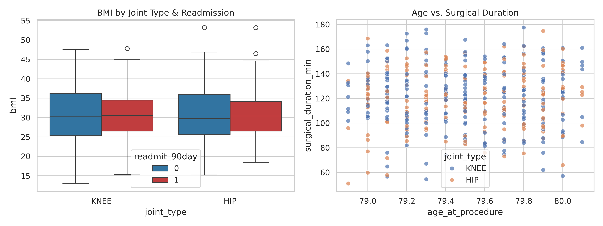

# Registry Summary Report

## Cohort Overview

| Joint Type | N | Mean Age | Median BMI | Mean Surg Min | 90-Day Readmits |
|---|---|---|---|---|---|
| HIP | 171 | 79.5 | 30.4 | 119.8 | 137 |
| KNEE | 251 | 79.5 | 30.5 | 122.1 | 195 |

## Analytical Distributions

